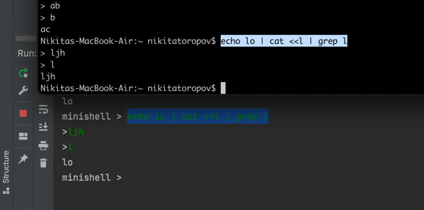
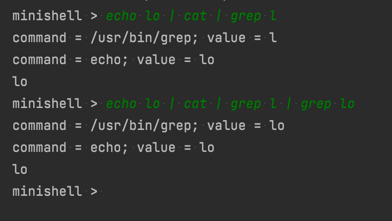
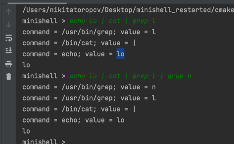

# minishell

## Общие инструкции

- [ ] Проект должен быть написан на Си с соблюдением `norminette`.
- [ ] Функции не должны завершаться неожиданно (segmentation fault, bus error,
  double free и т.д.) за исключением неопределенного поведения.
- [ ] Утечки памяти не допускаются.
- [ ] `Makefile` должен как минимум содержать правила `$(NAME)`, `all`, `clean`
  , `fclean` и `re`.

- [ ] Название программы: `minishell`
- [ ] Разрешенные файлы: Makefile, *.h, *.c
- [ ] Makefile: NAME, all, clean, fclean, re
- [ ] Разрешенные функции:
    - readline, rl_clear_history, rl_on_new_line,
    - rl_replace_line, rl_redisplay, add_history,
    - printf, malloc, free, write, access, open, read,
    - close, fork, wait, waitpid, wait3, wait4, signal,
    - sigaction, sigemptyset, sigaddset, kill, exit,
    - getcwd, chdir, stat, lstat, fstat, unlink, execve,
    - dup, dup2, pipe, opendir, readdir, closedir,
    - strerror, perror, isatty, ttyname, ttyslot, ioctl,
    - getenv, tcsetattr, tcgetattr, tgetent, tgetflag,
    - tgetnum, tgetstr, tgoto, tputs
- [ ] Использование `libft` разрешено

## Minishell должен уметь:

- [x] Показывать `prompt`, когда ждет новую команду.
- [x] Иметь историю работы.
    - [x] Сохраняет прошлые вводы в рамках одной сессии.
    - [x] Можно проверить с помощью стрелок вверх или вниз.
    - [x] Реализовано с помощью
      функции [add_history](https://tiswww.case.edu/php/chet/readline/history.html#:~:text=Function%3A%20void-,add_history,-(const%20char%20*string)
- [ ] Находить и запускать исполняемый файл (на основе PATH или с использованием
  относительного или абсолютного пути).
- [ ] Не использовать более одной глобальной переменной.
- [x] Не интерпретировать незакрытые кавычки, которые не требуются субъекту,
  такому как `\` или `;`.
- [x] Обрабатывать одинарную кавычку `'`, которая должна препятствовать
  интерпретации оболочкой метасимволов в кавычках.
- [x] Обрабатывать двойные кавычки `"`, которые должны препятствовать
  интерпретации оболочкой метасимволов в последовательности в кавычках за
  исключением знака `$`.
- [ ] Операторы перенаправления вывода
    - [ ] Реализовать пайпы (символ `|`). Вывод каждой команды соединяется со
      входом следующей команды через пайп.
        - `echo 'Строка с числом 901255323' | grep -E -o '[0-9]+'`
        - `grep -E -o '[0-9]+' 'Строка с числом 901255323'`
            - вернет `901255323`
    - [ ] `>` перенаправляет вывод в файл.
        - перезаписывает содержимое файла
        - `echo "hello" > one.txt > two.txt > three.txt`
            - создаст все файлы если их нет `one.txt`, `two.txt`, `three.txt`
            - запишет только в `three.txt`
        - `> /dev/null`
            - частный случай вывод **никуда не сохраняется**
    - [ ] `>>` должен перенаправлять вывод в режиме добавления.
        - аналогичен `>` не удаляет содержимое файла, а дописывает новые данные
          к уже существующим.
    - [ ] `<` перенаправляет input.
        - следующий после `<` токен будет считаться именем файла как источником
          ввода вместо клавиатуры
        - команды ниже эквивалентны
            - `КОМАНДА1 < ФАЙЛ1`
            - `cat ФАЙЛ1 | КОМАНДА1`
    - [ ] `<<` следует указать разделитель, а затем читать ввод, пока не будет
      видна строка, содержащая разделитель. Он не должен обновлять историю!
        - дописывает данные в конец файла.
- [ ] Обрабатывать переменны окружения (`$`, за которым последовательность
  символов), которые дожлны расширяться до их значения.
- [x] Handle $? which should expand to the exit status of the most recently
  executed foreground pipeline.
- [ ] Обрабатывать `ctrl-C`, `ctrl-D` и `ctrl-\`, которые ведут себя аналогично
  с bash.
- [ ] В интерактивном (диалоговом) режиме:
    - [ ] `ctrl-C` показывает новый prompt на новой строке.
    - [ ] `ctrl-D` выходит из оболочки.
    - [ ] `ctrl-\` ничего не делает.
- [ ] В оболочке должны быть реализованы встроенные функции:
    - [x] `echo` с флагом `-n` (вывод без переноса строки в конце).
        - вывод всего что после `ehcho`
    - [ ] `cd` только с относительным или с абсолютным путем.
        - перемещение по файловой системе
    - [x] `pwd` без флагов.
        - абсолютный путь текущей директории
    - [x] `export` без флагов.
        - `$ export name=student` передает переменную "name" со значением "
          student":
    - [x] `unset` без флагов.
        -
        противоположность `export` ([статья с примерами](https://www.cyberciti.biz/faq/linux-osx-bsd-unix-bash-undefine-environment-variable/))
    - [x] `env` без флагов или аргументов.
        - выводит список переменных окружения
    - [x] `exit` без флагов.

Функция `readline()` может вызвать утечки памяти. Их не нужно исправлять.

# Minishell прогресс:

- [x] Запускается с помощью `CMake` и показывает `prompt`.
    - [x] Сконфигурировал `CMake` файл чтобы запускалось с
      библиотекой `readline`
        - [инструкция](https://youtrack.jetbrains.com/issue/CPP-12828/CMake-Readline-Support)
    - [x] Минимальный `.h` и `main.c`
    - [x] Лексер
        - делит `prompt` на токены с учетом:
            - `"`, `'` кавычек
            - `\`, `;` не интерпретируемых символов
            - `$` переменных окружения
    - Операции:
        - **export**
            - допустимые аргументы для этой операции
                - [ ] `XPC_FLAGS=0x0`
                - [ ] `XPC_FLAGS=`
                - [ ] `XPC_FLAGS` - **env** такой параметр не покажет!
        - **env**
        - **cd**
            - перейти в директорию
                - `char *getcwd(char *buffer, size_t size);`
                - `int chdir(const char *path);` - смена текущей рабочей
                  директории
            - как это влияет на input/output (< > >>)
            - pipe
            - [x] "cd", когда PWD не существует в env
                - [x] после cd в OLDPWD = ""
                - [x] новая переменная PWD не появляется
            - [x] когда не существует OLDPWD
                - [x] не появляется после выполнения cd
            - не существуют PWD и OLDPWD
                - переменные не появляются после выполнения cd
            - [x] если удалить HOME, команда cd без пути не работает
                - `-bash: cd: HOME not set`

# Тесткейсы для проверки <, <<, >, >>

- [ ] `echo "llllllll" | grep l | grep a`
    - пустой вывод
- [ ] `echo "aaaaaaaa" | grep l | grep a`
    - пустой вывод
- [ ] `echo "aaaaaaaa" | grep a | grep a`
    - aaaaaaaa

****

- [z] `grep a << b`
- [ ] `grep a << b | grep с`
    - проверять нужно вводя то, что поймает `grep a`
- [ ] `echo "aaaaaaaa" | grep a << b | grep c`
  - проверять нужно вводя то, что поймает `grep a` и `grep с`
- [ ] `echo "aaaaaaaa" | grep с | grep a << b`
  - проверять нужно вводя то, что поймает `grep a`

- [ ] `echo lo | cat | grep l | grep n`
- [ ] `echo loh | grep l <<a`
- [ ] `cat test.txt | grep l >> test.txt`

- [ ] `echo lo | cat | grep l | grep l`
****
